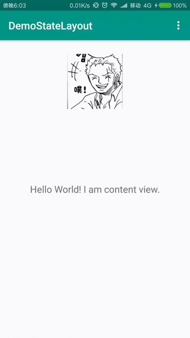

# StateLayout
A custom layout that can easily switch different states(like empty,error,progress,content) with animations.





# Usage
**Add the dependencies to your gradle project:**

### gradle
``` javascript
	dependencies {
    	compile 'com.lufficc:stateLayout:0.0.5'
	}
```
### maven
``` xml
	<dependency>
      <groupId>com.lufficc</groupId>
      <artifactId>stateLayout</artifactId>
      <version>0.0.5</version>
      <type>pom</type>
    </dependency>
```
### Ivy
``` xml
	<dependency org='com.lufficc' name='stateLayout' rev='0.0.5'>
      <artifact name='$AID' ext='pom'></artifact>
    </dependency>
```

## Add StateLayout to your layout file
# *Remember ,StateLayout can only hold one direct child* #
```xml
    <?xml version="1.0" encoding="utf-8"?>
    <com.lufficc.stateLayout.StateLayout xmlns:android="http://schemas.android.com/apk/res/android"
        xmlns:tools="http://schemas.android.com/tools"
        android:id="@+id/stateLayout"
        android:layout_width="match_parent"
        android:layout_height="match_parent"
        android:paddingBottom="@dimen/activity_vertical_margin"
        android:paddingLeft="@dimen/activity_horizontal_margin"
        android:paddingRight="@dimen/activity_horizontal_margin"
        android:paddingTop="@dimen/activity_vertical_margin"
        tools:context="com.lcc.demo.statelayout.MainActivity">
        <FrameLayout
            android:layout_width="match_parent"
            android:layout_height="match_parent">
            <ImageView
                android:padding="10dp"
                android:layout_gravity="center_horizontal"
                android:layout_width="wrap_content"
                android:layout_height="wrap_content"
                android:src="@mipmap/avatar" />
            <TextView
                android:layout_width="wrap_content"
                android:layout_height="wrap_content"
                android:layout_gravity="center"
                android:textSize="18sp"
                android:text="@string/demo" />
        </FrameLayout>
    </com.lufficc.stateLayout.StateLayout>

```

## operation in java
``` java
        stateLayout.showErrorView(); //switch to error view
        stateLayout.showErrorView(msg); //switch to error view with a message

        stateLayout.showEmptyView();  //switch to empty view
        stateLayout.showEmptyView(msg);  //switch to empty view with a message

        stateLayout.showProgressView();  //switch to progress view
        stateLayout.showProgressView(msg);  //switch to progress view with a message

        stateLayout.showContentView();  //switch to your content view
```
## custom


# License
	Copyright 2015 Miguel Catalan Bañuls

	Licensed under the Apache License, Version 2.0 (the "License");
	you may not use this file except in compliance with the License.
	You may obtain a copy of the License at

		http://www.apache.org/licenses/LICENSE-2.0

	Unless required by applicable law or agreed to in writing, software
	distributed under the License is distributed on an "AS IS" BASIS,
	WITHOUT WARRANTIES OR CONDITIONS OF ANY KIND, either express or implied.
	See the License for the specific language governing permissions and
	limitations under the License.